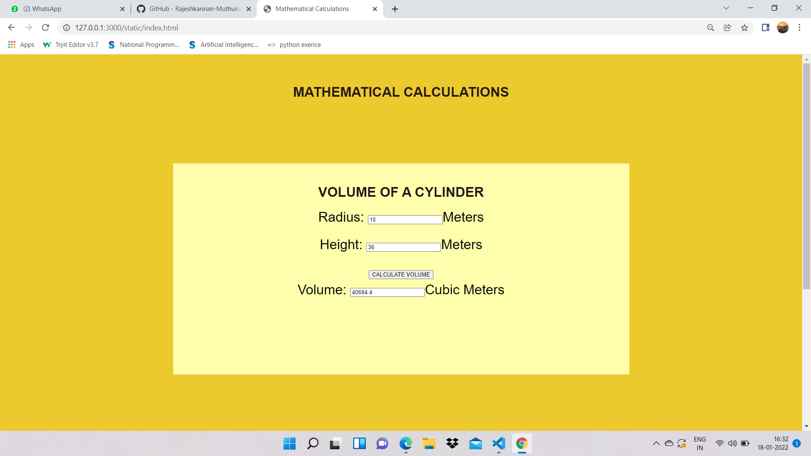
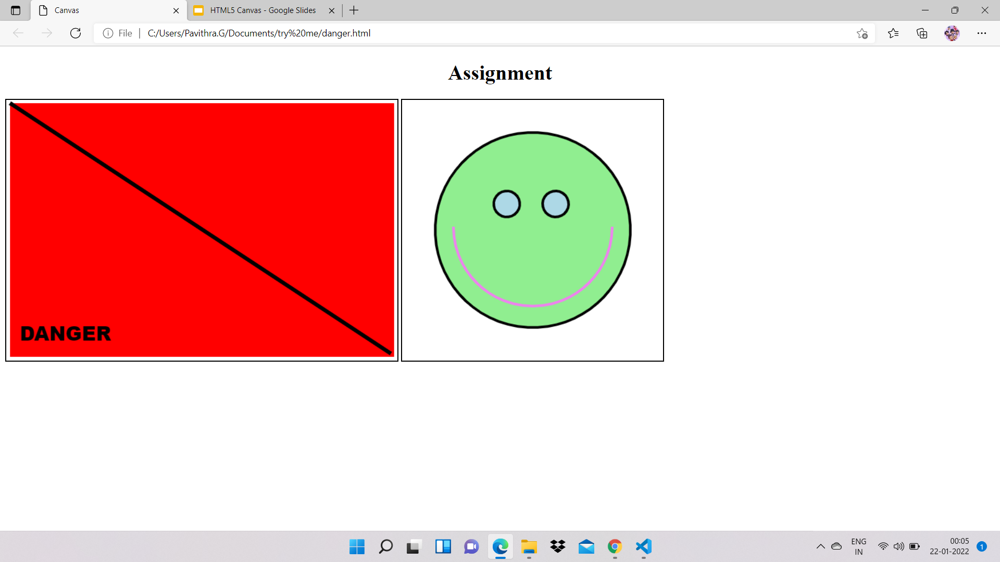

# Web Page for Mathematical Calculations

## AIM:

To design a static website with validation to perform mathematical calculations in client side.

## DESIGN STEPS:

### Step 1:

Requirement collection

### Step 2:

Creating the layout using HTML and CSS.

### Step 3:

Write javascript to perform the calculations.

### Step 4:

Include regularexpression based input validation.

### Step 5:

Validate the layout in various browsers.

### Step 6:

Validate the HTML code.

### Step 6:

Publish the website in the given URL.

## PROGRAM :

--include your code--
~~~
<!DOCTYPE html>
<html lang="en">
  <head>
    <meta charset="UTF-8" />
    <meta http-equiv="X-UA-Compatible" content="IE=edge" />
    <meta name="viewport" content="width=device-width, initial-scale=1.0" />
    <title>Mathematical Calculations</title>
  
  
  </head>
  <h1 style="text-align: center;">MATHEMATICAL CALCULATIONS</h1>
  <body>

  

            <h1>VOLUME OF  A CYLINDER</h1>
            <form>
                

                    <lable for="bedit">Radius:</lable>
                    <input type="text" id="bedit" value=""/>Meters
                
 
                

                    <lable for="aedit">Height:</lable>
                    <input type="text" id="aedit" value=""/>Meters
                
 
                
                

                    <input type="button" value="CALCULATE VOLUME" id="calbutton1"/>
                

                

                    <lable for="cedit">Volume:</lable>
                    <input type="text" id="cedit" readonly="0"/>Cubic Meters
                
 
              
            </form>
        

        
        

        

            <h1>AREA OF A RECTANGLE</h1>
            <form>
                

                  <lable for="lengthedit">LENGTH:</lable>
                  <input type="text" id="lengthedit" value=" "/>Meters
                
 
                

                  <lable for="breadthedit">BREADTH:</lable>
                  <input type="text" id="breadthedit" value=" "/>Meters
                
 
                

                  <input type="button" value="CALCULATE AREA" id="calbutton2"/>
                
 
                

                  <lable for="areaedit">AREA:</lable>
                  <input type="text" id="areaedit" readonly="0"/>Square Meters
                
 
                

              
                
 
                
            </form>
    
            

        

         
  </body>
</html>
~~~

## OUTPUT:

-- include your output screenshots ---

## Result:

Thus a website is designed to perform mathematical calculations in the client side.

## HTML CANVASING ASSIGNMENT:

### PROGRAM:
~~~
<!DOCTYPE html>
<html>
    <title>Canvas</title>
    <body>
        <h1 style="text-align: center;">Assignment</h1>
        <canvas id="mycanvas" width="600px" height="400px" style="border:2px solid #000000">
        </canvas>
        

        <canvas id="canvas" width="400px" height="400px" style="border:2px solid #000000">
        </canvas>
        
    </body>
</html>
~~~

## OUTPUT:
